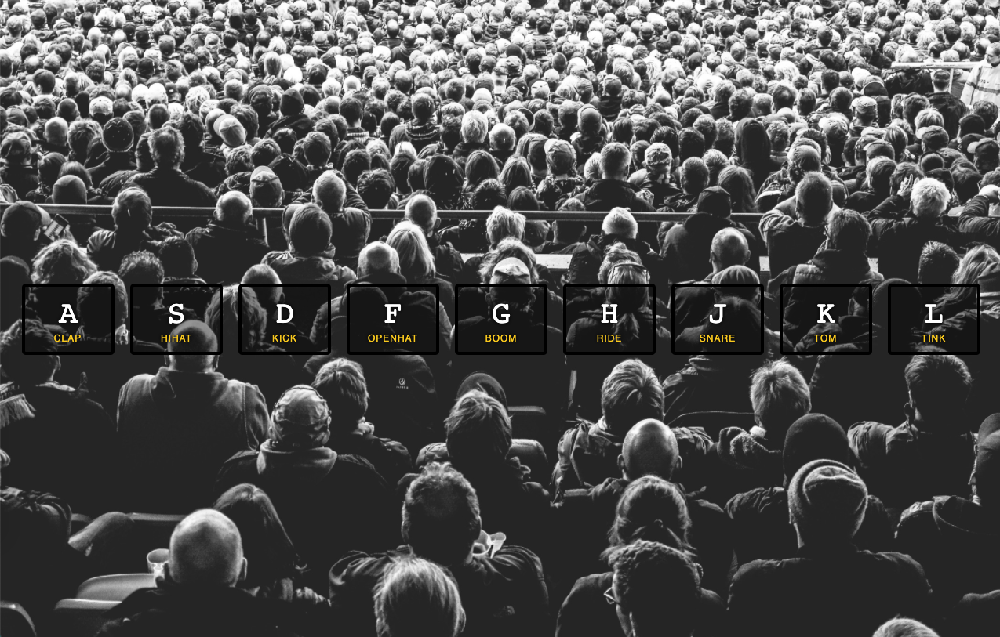
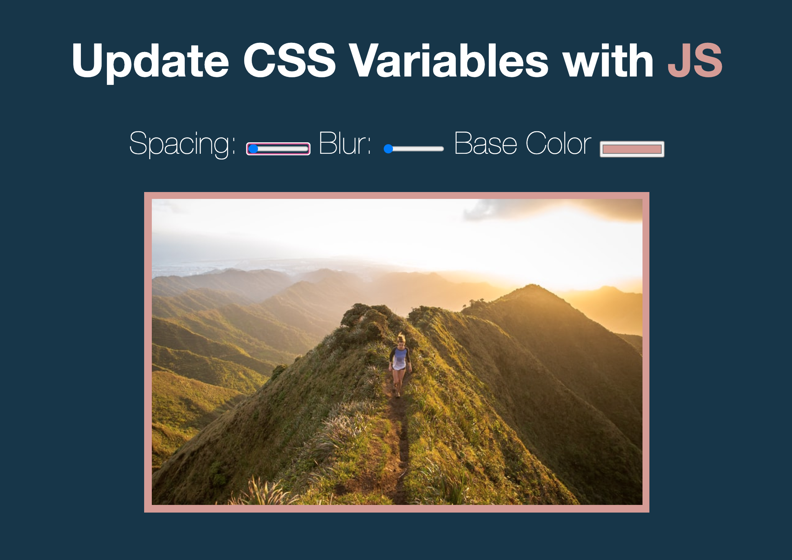

# JavaScript 30

Wes Bos's 30 days of JavaScript tutorials and practice. No jQuery used. Only HTML, CSS, and vanilla JavaScript.

## 01-Drum Kit

This tutorial adds the functionality to a pre-styled drum kit. It uses an event listener to play sound and adds and removes classes to animate.

## 02-Clock

This tutorial adds the functionality to a pre-styled clock. It uses CSS transform rotate and transitions, a JavaScript transform function, and Javascript setInterval to animate the clock.

## 02-Clock

This tutorial uses CSS variables and javascript to allow range sliders to adjust image.

